 

I like knowing exactly why a program is fast. 
So I write my own chess engine, measure it, and rewrite it until the numbers go up.

<h3></h3>

<table>
  <tr>
    <td width="33%" align="center" valign="top">
      <h3><a href="https://github.com/Justmaii/MaiEngineV3">MaiEngine v3</a></h3>
      current
      
A UCI chess engine in C++20. It runs the Stockfish 19 NNUE network with my own inference code (bit-exact with Stockfish), a Stockfish-style search and Lazy SMP.

      
      
      
        
      <b>+269 Elo</b> vs <a href="https://github.com/imInph/inphish">inphish</a> 5.0 
      10+0.1, 60 games, no losses
    </td>
    <td width="33%" align="center" valign="top">
      <h3><a href="https://github.com/Justmaii/MaiEngineV2">MaiEngine v2</a></h3>
      C#
      
The second rewrite, and my first NNUE. It evaluates with the Stockfish 15.1 network, and its inference matches Stockfish's raw output on 300 out of 300 test positions.

      
      
      
    </td>
    <td width="33%" align="center" valign="top">
      <h3><a href="https://github.com/Justmaii/MaiEngine">MaiEngine</a></h3>
      v1
      
Where it started. A chess engine in C# with no chess libraries: board, move generation, search and evaluation all written by hand, plus its own board UI.

      
        
      Even with <b>Stockfish 16 @2200</b> 
      150 ms per move
    </td>
  </tr>
</table>

Also: <a href="https://github.com/Justmaii/mini-stackoverflow">mini-stackoverflow</a>, a small Q&amp;A site I built to learn ASP.NET and EF Core.

  

<h3></h3>

  

<h3></h3>

  

<h3></h3>

<picture>
  <source media="(prefers-color-scheme: dark)" srcset="https://raw.githubusercontent.com/Justmaii/Justmaii/output/snake-dark.svg" />
  <source media="(prefers-color-scheme: light)" srcset="https://raw.githubusercontent.com/Justmaii/Justmaii/output/snake-light.svg" />
  
</picture>

  

Every MaiEngine version is tested in real matches. The logs and PGNs are in each repo.

